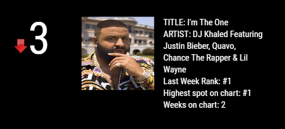
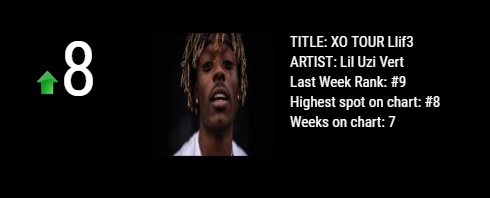
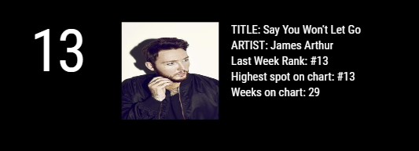
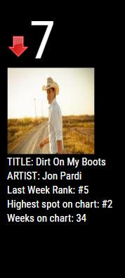

## MMM-MusicCharts
Top music charts for MagicMirror 2

## Examples

* `git clone https://github.com/cowboysdude/MMM-MusicCharts` into the `~/MagicMirror/modules` directory.
* `cd ~MagicMirror/modules/MMM-MusicCharts`
* type `npm install`

## Config.js entry and options

    {
        module: 'MMM-MusicCharts',
        position: 'top_left',
        config: {
            chart: 'hot-100',
        }
    },

## Overall Popularity

    Billboard 200: 'billboard-200'
    Artist 100: 'artist-100'
    Radio Songs: 'radio-songs'
    Billboard Twitter Real-Time: 'billboard-twitter-realtime'
    The Hot 100: 'hot-100'
    Digital Song Sales: 'digital-song-sales'
    Songs Of The Summer: 'summer-songs'
    Billboard Twitter Top Tracks: 'twitter-top-tracks'
    Billboard Twitter Emerging Artists: 'twitter-emerging-artists'
    On-Demand Songs: 'on-demand-songs'
    Streaming Songs: 'streaming-songs'
    Top Album Sales: 'top-album-sales'
    Vinyl Albums: 'vinyl-albums'
    Digital Albums: 'digital-albums'
    Independent Albums: 'independent-albums'
    Catalog Albums: 'catalog-albums'
    Social 50: 'social-50'
    Tastemaker Albums: 'tastemaker-albums'

## Breaking and Entering

    Heatseekers Albums: 'heatseekers-albums'

## Pop

    Pop Songs: 'pop-songs'
    Adult Pop Songs: 'adult-pop-songs'
    Adult Contemporary: 'adult-contemporary'

## Country

    Country Digital Song Sales: 'country-digital-song-sales'
    Country Streaming Songs: 'country-streaming-songs'
    Top Country Albums: 'country-albums'
    Bluegrass Albums: 'bluegrass-albums'
    Hot Country Songs: 'country-songs'

## Rock

    Hot Rock Songs: 'rock-songs'
    Country Airplay: 'country-airplay'
    Rock Airplay: 'rock-airplay'
    Rock Digital Song Sales: 'rock-digital-song-sales'
    Rock Streaming Songs: 'rock-streaming-songs'
    Top Rock Albums: 'rock-albums'
    Alternative Songs: 'alternative-songs'
    Alternative Albums: 'alternative-albums'
    Adult Alternative Songs: 'triple-a'
    Mainstream Rock Songs: 'hot-mainstream-rock-tracks'
    Hard Rock Albums: 'hard-rock-albums'
    Americana/Folk Albums: 'americana-folk-albums'

## R&B/Hip-Hop

    Hot R&B/Hip-Hop Songs: 'r-b-hip-hop-songs'
    R&B/Hip-Hop Airplay: 'hot-r-and-b-hip-hop-airplay'
    R&B/Hip-Hop Digital Song Sales: 'r-and-b-hip-hop-digital-song-sales'
    R&B/Hip-Hop Streaming Songs: 'r-and-b-hip-hop-streaming-songs'
    Hot R&B Songs: 'r-and-b-songs'
    R&B Streaming Songs: 'r-and-b-streaming-songs'
    Hot Rap Songs: 'rap-song'
    Rap Streaming Songs: 'rap-streaming-songs'
    Top R&B/Hip-Hop Albums: 'r-b-hip-hop-albums'
    R&B Albums: 'r-and-b-albums'
    Rap Albums: 'rap-albums'
    Adult R&B Songs: 'hot-adult-r-and-b-airplay'
    Hot Dance/Electronic Songs: 'dance-electronic-songs'
    Rhythmic Songs: 'rhythmic-40'

## Dance/Electronic

    Dance/Electronic Digital Song Sales: 'dance-electronic-digital-song-sales'
    Dance/Electronic Streaming Songs: 'dance-electronic-streaming-songs'
    Dance Club Songs: 'dance-club-play-songs'
    Dance/Mix Show Airplay: 'hot-dance-airplay'
    Top Dance/Electronic Albums: 'dance-electronic-albums'

## Latin

    Hot Latin Songs: 'latin-songs'
    Latin Digital Song Sales: 'latin-digital-song-sales'
    Latin Airplay: 'latin-airplay'
    Latin Streaming Songs: 'latin-streaming-songs'
    Tropical Songs: 'tropical-songs'
    Latin Pop Songs: 'latin-pop-songs'
    Regional Mexican Songs: 'regional-mexican-songs'
    Regional Mexican Albums: 'regional-mexican-albums'
    Latin Pop Albums: 'latin-pop-albums'
    Top Latin Albums: 'latin-albums'

## Christian/Gospel

    Hot Christian Songs: 'christian-songs'
    Christian Airplay: 'christian-airplay'
    Christian Digital Song Sales: 'christian-digital-song-sales'
    Tropical Albums: 'tropical-albums'
    Christian Streaming Songs: 'christian-streaming-songs'
    Top Christian Albums: 'christian-albums'
    Hot Gospel Songs: 'gospel-songs'
    Gospel Digital Song Sales: 'gospel-digital-song-sales'
    Gospel Streaming Songs: 'gospel-streaming-songs'
    Top Gospel Albums: 'gospel-albums'
    Gospel Airplay: 'gospel-airplay'

## Holiday

    Holiday 100: 'hot-holiday-songs'
    Holiday Digital Song Sales: 'holiday-season-digital-song-sales'
    Holiday Albums: 'holiday-albums'
    Holiday Streaming Songs: 'holiday-streaming-songs'
    Holiday Airplay: 'holiday-songs'

## Additional Genres

    Blues Albums: 'blues-albums'
    Classical Albums: 'classical-albums'
    Comedy Albums: 'comedy-albums'
    Kid Albums: 'kids-albums'
    Jazz Albums: 'jazz-albums'
    Smooth Jazz Songs: 'jazz-songs'
    New Age Albums: 'new-age-albums'
    Reggae Albums: 'reggae-albums'

## Soundtracks: 'soundtracks'

    World Albums: 'world-albums'

## International

    Japan Hot 100: 'japan-hot-100'
    China V Chart: 'china-v-chart'
    The Official U.K. Singles Chart: 'united-kingdom-songs'
    The Official U.K. Albums Chart: 'united-kingdom-albums'
    Billboard Canadian Hot 100: 'canadian-hot-100'
    Canadian Digital Song Sales: 'hot-canada-digital-song-sales'
    Billboard Canadian Albums: 'canadian-albums'
    Germany Songs: 'germany-songs'
    Germany Albums: 'german-albums'
    France Songs: 'france-songs'

## Web

    Spotify Velocity: 'spotify-velocity'
    Spotify Rewind: 'spotify-rewind'
    Spotify Viral 50: 'spotify-viral-50'
    YouTube: 'youtube'
    LyricFind Global: 'lyricfind-global'
    LyricFind U.S.: 'lyricfind-us'
    Next Big Sound: 'next-big-sound-25'
