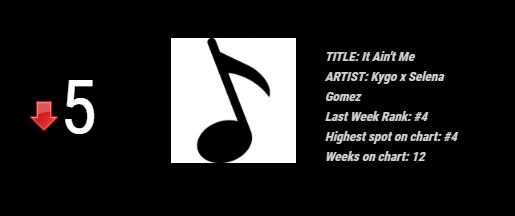
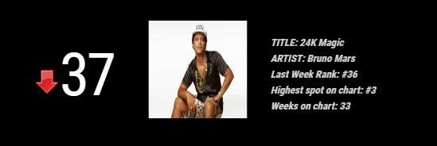

## MMM-MusicCharts

CURRENTLY THE API FOR THIS IS DOWN WITH NO ESTIMATION WHEN IT WILL EVER WORK AGAIN.....I'm trying to locate a new source for the info.

## Examples

* `git clone https://github.com/cowboysdude/MMM-MusicCharts` into the `~/MagicMirror/modules` directory.
* `cd ~MagicMirror/modules/MMM-MusicCharts`
* type `npm install`

## Config.js entry and options

    {
        module: 'MMM-MusicCharts',
        position: 'top_left',
        config: {
            chart: ' ',
        }
    },

## Overall Popularity

   

## Breaking and Entering

    

## Pop

  
## Country

    

## Rock

   

## R&B/Hip-Hop

     

## Dance/Electronic

    

## Christian/Gospel

     
## Holiday

  
## Additional Genres

    
## Soundtracks: 'soundtracks'

     

## International

     

## Web

   
